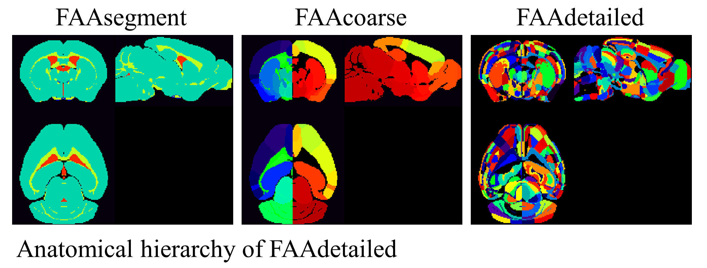

# Flexible annotation atlas (FAA) of the mouse brain

This repository contains Python codes for our papers ([Sci Rep](https://www.nature.com/articles/s41598-021-85807-0) and [bioRxiv](https://doi.org/10.1101/2020.02.17.953547)) __"Flexible annotation atlas of the mouse brain: combining and dividing brain structures of the Allen Brain Atlas while maintaining anatomical hierarchy"__.

Several FAAs are available in [an FAAs folder](/FAAs/FAAdetailed/reconstruction-info/README.md) including FAAocd that was used in [NeuroImage](https://www.sciencedirect.com/science/article/pii/S1053811920308041) for cortico-striatal-thalamo (CST) circuitry analysis.

## Highlihgts
- A flexible annotation atlas (FAA) for the mouse brain is proposed.
- FAA is expected to improve whole brain ROI-definition consistency among laboratories.
- The ROI can be combined or divided objectively while maintaining anatomical hierarchy by leveraging public resources of the Allen Institute for Brain Science.
- A mere two-step procedure with user-specified, text-based inforamtion and Python codes constructs FAAs with total ROI counts from 1 to more than 1,000.

## Examples of FAA
FAA consists of a JSON-formatted text file (anatomical ontology, AO) and a three-dimensional volume file of the mouse brain (annotation volume, AV). Examples of FAA are shown below: FAAsegment (total node count: 4), FAAcoarse (101), and FAAdetailed (1381). In FAAdetailed, nodes for the hippocampus and striatum were divided to two (dorsal and ventral regions) based on gene expression and fiber projection, respectively.

An icicle plot shows anatomical hierarchy of FAAdetailed with a brain structure acronym and its volume in nL ( _e.g._ "CH_R: 138284" stands for a brain structure "Cerebrum" in the right hemisphere "_R" with a volume size of 138,284 nl). In an FAAs folder, some [FAAs](https://github.com/ntakata/flexible-annotation-atlas/blob/master/FAAs/FAAbase/AV_LR_remapID_RAS.nii) and an [HTML](https://github.com/ntakata/flexible-annotation-atlas/blob/master/FAAs/FAAbase/icicleplot_FAA.html) file for zoomable visualization of anatomical hierarchy are available.



## Steps to construct your annotation atlas
### 0. Preprocessing
Run `Prepare_AObaseAVbase.ipynb` to obtain preprocessed files in the data folder: a text file ( __AObase.json__) and a volume file ( __AVbase.nrrd__). This preprocessing eliminates _destructive_ brain structures in the original anatomical ontology file and an annotation volume of the mouse brain provided by the Allen Institute for Brain Science (AIBS).

### 1. Combining brain structures
Copy __AObase.json__ and rename it to __AObase_c.json__ in the data folder. Edit __AObase_c.json__ with a text editor to combine brain structures in __AVbase.nrrd__. Specifically, delete all contents within brackets [] of a key "children" for an inner node to combine its all descendent nodes. For example, `"children": [ {"id":8, ... }, ..., {"id": 73, ..., "voxel_count": 6136}], "voxel_count": null` would be `"children": [], "voxel_count": 12345` (Any number, including null, can be used for 12345, as it will be automatically corrected later. Specifying the volume of the ROI facilitates easier viewing of the follwoing visualization) in a file __AObase_c.json__. Zoomable visualization of anatomical hierarchy of __AObase_c.json__ is available using [an HTML file](https://github.com/ntakata/flexible-annotation-atlas/blob/master/FAAs/icicleplots), which facilitates ROI volume check and is useful to decide which brain structures to be combined or not.

### 2. Dividing a brain structure based on gene expression and/or fiber projection.
Specify text-based information in `Divide_nodes.ipynb`: 1) IDs of brain structures ( __Target_ROI_IDs__), 2) Experimental ID ( __ExpID__) of a gene of interest, and 3) __Acronyms__ of a brain structures which are a source and a target of neuronal fiber innervation. Then, run `Divide_nodes.ipynb` to obtain your FAA, which consists of an ontology text file ( __AO_LR_remapID.json__) and an annotation volume ( __AV_LR_remapID_RAS.nii__) in the data folder.

A more detailed manual describing the step-by-step procedure is available [here](/Supplementary_Tables/table_allen_v5.2.pdf) or at Supplementary Tables 2-4 in our paper.

You can use Python scripts (Prepare_AObaseAVbase.py, Divide_nodes.py) instead of these Jupyter notebooks. For example, execute `ipython Prepare_AObaseAVbase.py` in an Anaconda Prompt.

## Q & As
### How to share your original FAA
There are two methods to share your FAA:
- **Direct Sharing**: Share the FAA files directly. This includes the 'AO_LR_remapID.json' and 'AV_LR_remapID_RAS.nii' files.
- **Text-Based Sharing**: Share text-based information that allows others to reconstruct your FAA. For example, please refer to [the 'FAAs' folder](/FAAs/FAAdetailed/reconstruction-info/README.md).

### Transforming NRRD images to NiFTI Format
NRRD images can be converted into NiFTI format in RAS orientation using [the code](https://github.com/ntakata/flexible-annotation-atlas/blob/master/notebooks/Transform_AllenImage_from_NRRD_to_NIfTI.ipynb).

### Downloading Structural images
Structural images, such as 'average_template_100.nrrd', can be downloaded from [the Allen Institute's webpage](https://download.alleninstitute.org/informatics-archive/current-release/mouse_ccf/average_template/)

### Precaution for dividing a ROI based on a gene expression energy
- [gene distribution](https://github.com/ntakata/flexible-annotation-atlas/issues/1#issue-2107405397)
- [registration](https://github.com/ntakata/flexible-annotation-atlas/issues/2#issue-2107428531)

## Software environment
The pipeline for FAA construction was created with Python (3.7.1) using AllenSDK (version 0.16.1, ``` python3 -m pip install allensdk```) written in Jupyter Notebook (5.6.0) on Anaconda (2018.12) on Windows 10 (Professional 64 bit, Microsoft). The yaml file for the anaconda environment is available in a yaml folder. [Nbparameterise](https://github.com/takluyver/nbparameterise) is also necessary.
