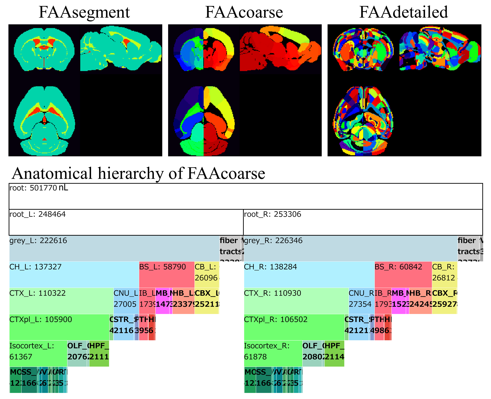

# Flexible annotation atlas (FAA) of the mouse brain

This repository contains Python codes for our paper __"Flexible annotation atlas of the mouse brain: combining and dividing brain structures of the Allen Brain Atlas while maintaining anatomical hierarchy"__. Please see our paper ([bioRxiv](bioRxiv)) for more information.

## Highlihgts
- A flexible annotation atlas (FAA) for the mouse brain is proposed.
- FAA is expected to improve whole brain ROI-definition consistency among laboratories.
- The ROI can be combined or divided objectively while maintaining anatomical hierarchy.
- FAA realizes functional connectivity analysis across the anatomical hierarchy.

## Example of FAA
Four FAAs are available in a FAAs folder which includes an annotation ontology text file, an annotation volume, and an html file for zoomable visualization of anatomical hierarchy.

## Steps to construct your annotation atlas
### 0. Preprocessing
This preprocessing eliminates _destructive_ brain structures in the original anatomical ontology file and an annotation volume of the mouse brain provided by the Allen Institute for Brain Science (AIBS). Run `Prepare_AObaseAVbase.ipynb` to obtain preprocessed files: a text file (AObase.json) and a volume file (AVbase.nrrd).

### 1. Combining brain structures
Copy AObase.json and rename it to AObase_c.json. Then, edit AObase_c.json with your text editor to combine brain structures in AVbase.nrrd.

### 2. Dividing a brain structures based on gene expression and/or fiber projection.
Specify 1) IDs of brain structures (Target_ROI_IDs), 2) Experimental ID (ExpID) of a gene of interest, and 3) Acronyms of a brain structures which are a source and a target of neuronal fiber innervation. Then, run `Divide_nodes.ipynb` to obtain your FAA, which consists of an ontology text file (AO_LR_remapID.json) and an annotation volume (AV_LR_remapID_RAS.nii).

## How to share your original FAA
There are two ways.
- Share your FAA itself (AO_LR_remapID.json and AV_LR_remapID_RAS.nii).
- Share a text-based information (AObase_c.json, Target_ROI_IDs, ExpID, Acronyms) to reconstruct FAA.

